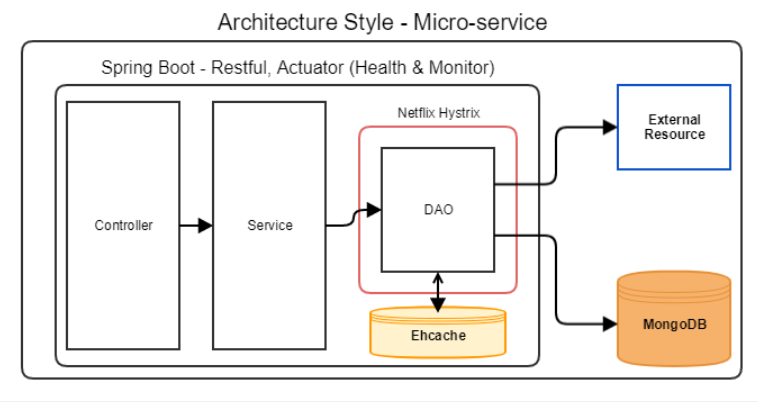
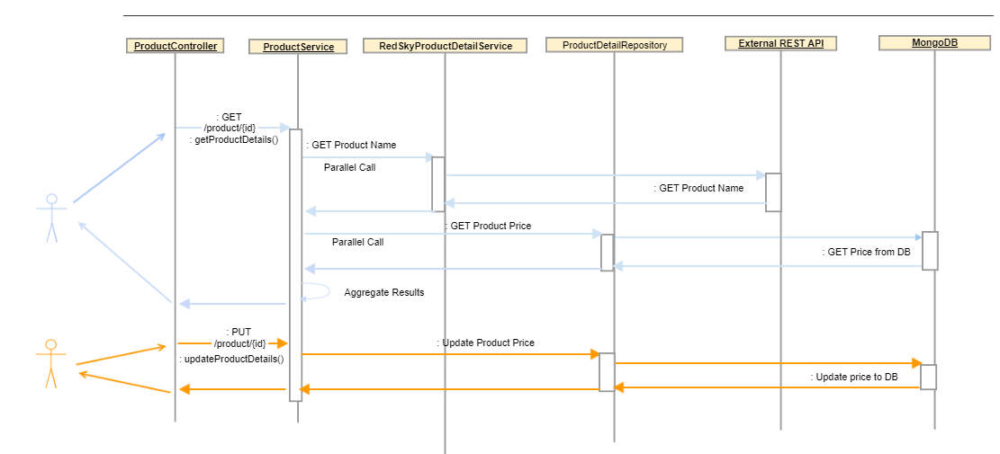
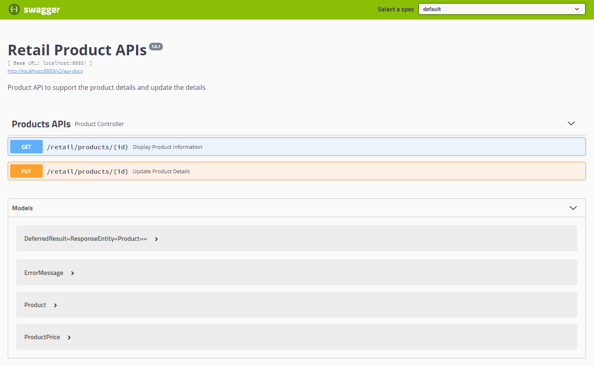
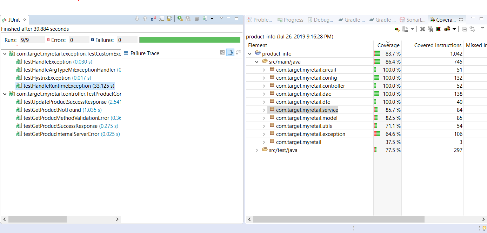
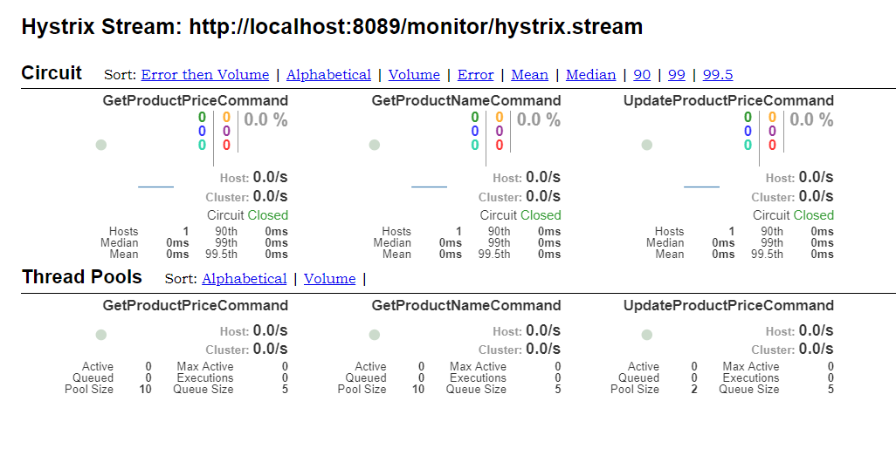

# Retail Product APIs 
### Case Study
myRetail is a rapidly growing company with HQ in Richmond, VA and over 200 stores across the east coast. myRetail wants to make its internal data available to any number of client devices, from myRetail.com to native mobile apps. 
The goal for this project is to create an end-to-end Proof-of-Concept for a products API, which will aggregate product data from multiple sources and return it as JSON to the caller.
## Playbook Instructions
### Pre Requisite
Java 8 or 11 and Gradle 5 Installation

### Local Code Set up & Deployment
1. Clone the Project : https://github.com/kalairaja/myRetail-product-dtls.git
2. Open terminal and navigate to Project location myRetail-product-dtls/
3. Run gradle build and bootRun
4. Test API with Swagger :<http://localhost:8883/swagger-ui.html> or Postman

## Test Data
    GET http://localhost:8883/retail/products/{id}
    GET Product {id}: 13860428,13860500,13860600

    PUT http://localhost:8883/retail/products/13860428
    PUT Request Body: {
              "id": 13860428
              "current_price": {
              "value": 106.99,
              "currency_code": "USD"
              }
           }

## Design, Development, Build, Deploy and Test Approach
To the given problem, Spring Boot architecture would be the preferred design for A fast, lightweight and more productive micro-services framework. The following technologies has been considered for the approach.
### Technologies
- Java8 or 11 - Programming Lanugage
- Gradle - Build Framework
- Spring Boot 2.1.4 - Spring Framework
- Embedded Mongo DB - NoSQL DB
- EhCache - Caching Strategy for API
- Hystrix Circuit Breaker - Cross Cutting Concern
- Hystrix Dashboard 
- Swagger2 - API Documentation
- Rx Java - Reactive and Event Driven Programming
### Architecture Style

### Sequence Diagram

### API Documentation
See Swagger <http://localhost:8883/swagger-ui.html#/>.

### Test Approach
#### Junit Test Result / Code Coverage

#### Use Swagger Test
Url <http://localhost:8083/swagger-ui.html> to test the application.

### Hystrix Dashboard
Input browser with <http://localhost:8883/hystrix>, Enter hystrix stream Url as <http://localhost:8089/monitor/hystrix.stream> .
Trigger a GET or PUT call. You will be able to see the Hystrix Dashboard as below. The Circuit Open will be enabaled when the system sense there is more than 50% of request is unsuccessful/errored while connecting to external / DB.

