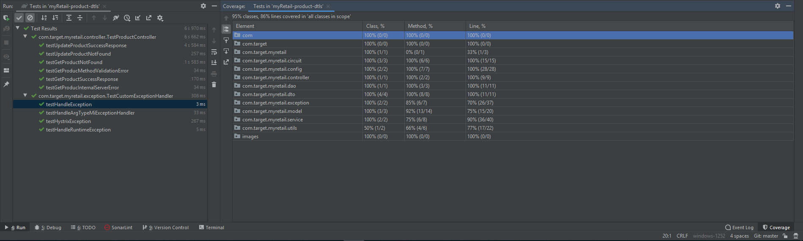
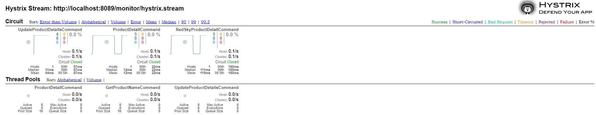

# Retail Product APIs 
### Case Study
myRetail is a rapidly growing company with HQ in Richmond, VA and over 200 stores across the east coast. myRetail wants to make its internal data available to any number of client devices, from myRetail.com to native mobile apps. 
The goal for this project is to create an end-to-end Proof-of-Concept for a products API, which will aggregate product data from multiple sources and return it as JSON to the caller.
## Playbook Instructions
### Pre Requisite
    Java 8 or 11 and Gradle 5 Installation

### Local Code Set up & Deployment
1. Clone the Project : https://github.com/kalairaja/myRetail-product-dtls.git
2. Open terminal and navigate to Project location myRetail-product-dtls/
3. Run gradle build and bootRun
4. Test API with Swagger :<http://localhost:8883/swagger-ui.html> or Postman

## Test Data
    GET 
        URI: http://localhost:8883/retail/products/{id}
        Product {id}: 13860428,13860500,13860600
        curl -X GET "http://localhost:8883/retail/products/13860428" -H "accept: application/json"

    PUT 
        URI: http://localhost:8883/retail/products/13860428
        PUT Request Body: {
              "id": 13860428
              "current_price": {
              "value": 106.99,
              "currency_code": "USD"
              }
        }
        curl -X PUT "http://localhost:8883/retail/products/13860428" -H "accept: application/json" -H 
        "Content-Type: application/json" -d "{     \"current_price\": 
        { \"value\": 700.00, \"currency_code\": \"USD\" }}"

## Design, Development, Build, Deploy and Test Approach
To the given problem, Spring Boot architecture would be the preferred design for A fast, lightweight and more productive micro-services framework. The following technologies has been considered for the approach.
### Technologies
    - Java8 or 11 - Programming Lanugage
    - Gradle 5.3.1 - Build Framework
    - Spring Boot 2.1.5 - Spring Framework
    - Embedded Mongo DB - NoSQL DB
    - EhCache - Caching Strategy for API
    - Hystrix Circuit Breaker - Cross Cutting Concern
    - Hystrix Dashboard 
    - Swagger2 - API Documentation
    - Rx Java - Reactive and Event Driven Programming
### Architecture Style

### Sequence Diagram

### API Documentation
See Swagger <http://localhost:8883/swagger-ui.html#/>.

### Sonar Code Review and Vulneranbility check (Done)

### Test Approach

#### Testing
Integration test covers most of the scenario. Mockito & RestAssured been used to mock the redsky service and embedded mango db to retrieve the data from datastore.

#### Junit Test Result / Code Coverage

#### Use Swagger Test
Url <http://localhost:8083/swagger-ui.html> to test the application.

### Hystrix Dashboard
Input browser with <http://localhost:8883/hystrix>, Enter hystrix stream Url as <http://localhost:8089/monitor/hystrix.stream> .
Trigger a GET or PUT call. You will be able to see the Hystrix Dashboard as below. The Circuit Open will be enabaled when the system sense there is more than 50% of request is unsuccessful/errored while connecting to external / DB.

•    Completeness:  Were problems addressed, did the code run? - Yes. Is it production ready (if not, explain why) - Yes
•    Do you have any examples of design work? - Yes attached above.
•    Have you done any work where you have had to scale your code? - Yes, Implemented caching, fault torence design. 
•    Testing—how did you test? - Unit test and Manual functional validation

### Production Recommendations:
Though this code is production ready, considering the CASE Study supporting 200 retails stores. I recommend the below prior to PROD.
Recommendation for Production Ready:
-   Authentication/Authorization using oAuth2.0
-   Cassandra / Reddis Database for High throughput.
-   Memcache or Persistence Reddis caching strategy to support high throughput.
